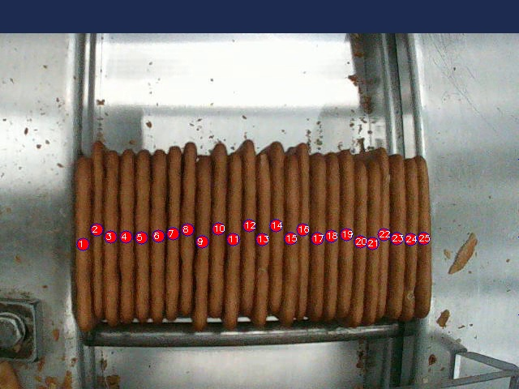

# 📦 Modelo de Contagem de Biscoitos

Este modelo de visão computacional foi treinado para contar o número de biscoitos em uma imagem usando **FRCNN Resnet50**.

## 📊 Especificações do Modelo
| Propriedade        | Valor                     |
|--------------------|-------------------------|
| Arquitetura       | FRCNN Resnet50           |
| Dataset          | Custom       |
| Formato de Entrada | Imagens JPG/PNG         |
| Resolução        | 640x640                   |
| Otimização       | -       |
| Tempo de Treinamento | -      |
| Precisão (mAP@50) | -                   |

## 🏗️ Treinamento do Modelo
O modelo foi treinado utilizando a seguinte abordagem:

1. **Pré-processamento**: 
   - Redimensionamento das imagens para **640x640 pixels**.
   - Aumento de dados (*Data Augmentation*) com **flip horizontal, brilho e contraste**.
   - Normalização para **[0,1]**.

2. **Treinamento**:
   - Utilizando **PyTorch + FRCNN Resnet50**.
   - **Batch size** de x para acelerar o treinamento.

3. **Validação**:
   - O modelo foi validado com **20% dos dados**.
   - Utilizou-se a métrica **x** para avaliar a precisão.

## 📷 Exemplo de Saída
Abaixo está um exemplo de saída do modelo:

